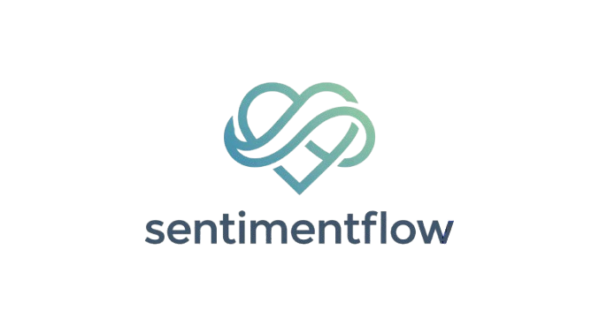

<div id="top">

<!-- HEADER STYLE: CLASSIC -->
<div align="center">



# SENTIMENTFLOW

<em></em>

<!-- BADGES -->


<em>Built with the tools and technologies:</em>


</div>
<br>

Pitching & Demo Video: [https://www.youtube.com/watch?v=N0qN1znd71c](https://www.youtube.com/watch?v=N0qN1znd71c)

---

## Table of Contents

- [Table of Contents](#table-of-contents)
- [Overview](#overview)
- [Features](#features)
- [Project Structure](#project-structure)
- [Getting Started](#getting-started)
    - [Prerequisites](#prerequisites)
    - [Installation](#installation)
    - [Usage](#usage)
    - [Testing](#testing)
- [Contributing](#contributing)
- [License](#license)

---

## Overview

SentimentFlow is a cutting-edge platform designed to automate and optimize customer service workflows using advanced AI and Large Language Models (LLMs). It bridges the gap between raw user feedback and actionable business intelligence by combining deep sentiment analysis with intelligent task management.

At its core, the system ingests unstructured data—such as reviews, messages, and support tickets—and processes them through a multi-stage pipeline. The "Brain" module dissects the content to understand not just the emotion (sentiment), but also the intent, urgency, and key topics. This intelligence is then used to automatically generate comprehensive case summaries, suggest appropriate resolutions, and assign priority levels.

For businesses, SentimentFlow eliminates the need for manual review of every single customer interaction. It transforms a chaotic influx of data into a structured, prioritized queue of tasks, ensuring that critical issues are addressed immediately while maintaining a scalable support infrastructure. The platform is built with a modern, responsive interface, allowing administrators to monitor system health, review AI suggestions, and manage workflows with ease.

---

## Features

- **Advanced Sentiment Analysis**: Utilizes Gemini AI to analyze customer feedback, identifying not just positive or negative sentiment, but also detecting specific emotions like anger, frustration, or joy.
- **Intelligent Case Management**: Automatically categorizes and prioritizes incoming messages. The system generates concise case summaries and suggests appropriate actions or resolutions, drastically reducing manual workload.
- **Real-time Monitoring**: Provides a live dashboard to visualize incoming feedback volume, sentiment trends, and system health, allowing businesses to stay connected with their customer base instantly.
- **Secure Admin Interface**: A protected admin portal enables authorized personnel to manage the system, review AI decisions, and ensure data privacy and integrity.
- **Data Persistence**: Robust database management ensures that all customer interactions and analysis results are stored securely and are available for future review and auditing.

---

## Project Structure

```sh
└── src/
    ├── app.py
    ├── brain.py
    ├── database.py
    ├── main.py
    ├── requirements.txt
    └── test_brain.py
```

---

## Getting Started

### Prerequisites

This project requires the following dependencies:

- **Programming Language:** Python
- **Package Manager:** Pip

### Installation

Build SentimentFlow from the source and intsall dependencies:

1. **Clone the repository:**

    ```sh
    git clone https://github.com/timmmtam/SentimentFlow
    ```

2. **Navigate to the project directory:**

    ```sh
    cd SentimentFlow/src
    ```

3. **Create Python Virtual Environment**

	```sh
	python -m venv .venv
	```

4. **Activate Python Virtual Environment**

	```sh
	source .venv/bin/activate
	```

5. **Install the dependencies:**

	```sh
	pip install -r requirements.txt
	```

6. **Set API Key**

```sh
echo GEMINI_API_KEY=your-api-key >> .env
```

### Usage

Run the project with:

```sh
uvicorn main:app --reload
```

Open a new terminal, then run (after activating virtual environment):

```sh
streamlit run app.py
```

### Cleanup

Press `Ctrl+C` on both terminals to stop uvicorn and streamlit.

Then, deactivate the virtual environment:

```sh
deactivate
```

---

## Contributing

- **💬 [Join the Discussions](https://github.com/timmmtam/SentimentFlow/discussions)**: Share your insights, provide feedback, or ask questions.
- **🐛 [Report Issues](https://github.com/timmmtam/SentimentFlow/issues)**: Submit bugs found or log feature requests for the `SentimentFlow` project.
- **💡 [Submit Pull Requests](https://github.com/timmmtam/SentimentFlow/blob/main/CONTRIBUTING.md)**: Review open PRs, and submit your own PRs.

<details closed>
<summary>Contributing Guidelines</summary>

1. **Fork the Repository**: Start by forking the project repository to your github account.
2. **Clone Locally**: Clone the forked repository to your local machine using a git client.
   ```sh
   git clone https://github.com/timmmtam/SentimentFlow
   ```
3. **Create a New Branch**: Always work on a new branch, giving it a descriptive name.
   ```sh
   git checkout -b new-feature-x
   ```
4. **Make Your Changes**: Develop and test your changes locally.
5. **Commit Your Changes**: Commit with a clear message describing your updates.
   ```sh
   git commit -m 'Implemented new feature x.'
   ```
6. **Push to github**: Push the changes to your forked repository.
   ```sh
   git push origin new-feature-x
   ```
7. **Submit a Pull Request**: Create a PR against the original project repository. Clearly describe the changes and their motivations.
8. **Review**: Once your PR is reviewed and approved, it will be merged into the main branch. Congratulations on your contribution!
</details>

<details closed>
<summary>Contributor Graph</summary>
<br>
<p align="left">
   <a href="https://github.com{/timmmtam/SentimentFlow/}graphs/contributors">
      
   </a>
</p>
</details>

---

<div align="right">

[![][back-to-top]](#top)

</div>


[back-to-top]: https://img.shields.io/badge/-BACK_TO_TOP-151515?style=flat-square


---
